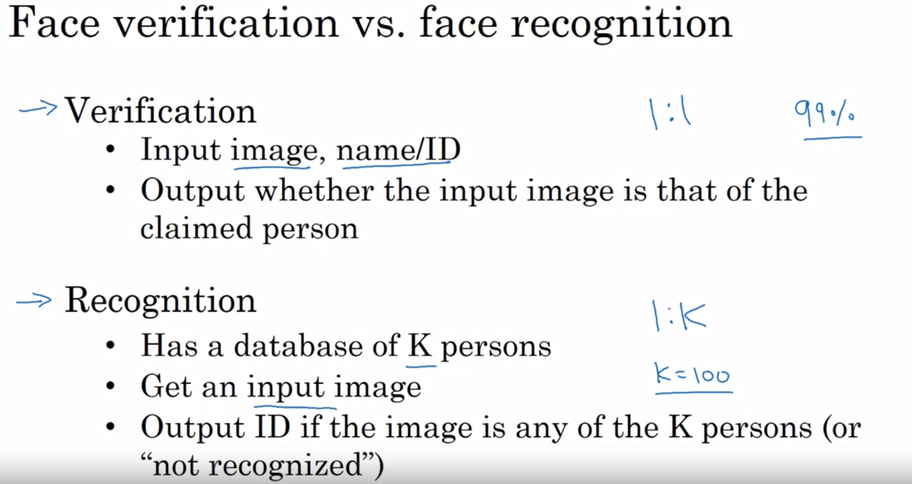

# CNN学习笔记(deep learning )

## Week 1

### One layer of a Convolutional Network

layer $\ell$ is a convolution layer

$f^{[l]} = filter\ size;$

$p^{[l]} = padding;$

$s^{[l]} = stride$

**Each filter is**: $f^{[l]}\times f^{[l]}\times n_C^{[l-1]}$

**Weights**: $f^{[l]}\times f^{[l]}\times n_C^{[l-1]}\times n_C^{[l]}$

**bias**: $n_C^{[l]}$

**Input**:$n_H^{[l-1]}\times n_W^{[l-1]}\times n_C^{[l-1]}$

**Output**:$n_H^{[l]}\times n_W^{[l]}\times n_C^{[l]}$

$n_H^{[l]}=\lfloor \frac {n_H^{[l-1]}-f^{[l]}+2p^{[l]}} {s^{[l]}} +1\rfloor$

### why convolution?

#### parameter sharing

用传统的Fully connected方法，需要的参数非常多。

parameter sharing: 一个detector在图片的一个地方有用，在图片的其他地方也能用。

#### Sparsity of connection

每一个输出只跟上一层的输出的一小部分有关。

## Week 2

### Why look at case studies?

卷积网络应用在许许多多的领域，学习他们最好的方法就是学习不同应用的例子。

### Classic Networks

#### LeNet-5

结构：

参数数量 ~= 60000

pattern: $n_H,n_W$变小，$n_C$变大。

重点看论文的Section 2

#### AlexNet

结构：

参数数量~=60000000

#### VGG

参数数量：138000000

### ResNets

#### Residual block

令$a^{[l+2]}=g(z^{[l+2]}+a^{[l]})$

这样可以训练更深的神经网络，因为ResNet能随着layers变大而减小training error.

### Why ResNets Work

residual network的权重很容易得到单位矩阵，因此随着层数增加， 至少不会增加误差

### Networks in Networks and 1x1 Convolutions

shrink height width and number of channels

### Inception Network Motivation

可以看出计算量显著减小了，并且不会影响网络的表现。

### Using Open-Source Implementation

use github.

## Week 3

### Object Localization

前两种一般只有一种物体，detection有多种物体。

object detection应该得到的输出为

$$ y = \left[ \matrix{  p_c \\  bx \\  by \\bw \\bh \\c1 \\c2 \\c3   } \right] $$

$p_c=1$代表这张图片里有需要识别的物体，$c_1,c_2,c_3$代表的是这个物体是什么，$b_x,b_y,b_w,b_h$代表这这个框图的坐标和大小。

### Landmark Detection

让输出中带特征点的坐标。

### Object Detection

sliding window is very slow.

### Bounding Box Predictions

将图像分为几个部分，每个部分来识别。

### Non-max Suppression

## Week 4

### What is face recognition?

- face recognition.
- make sure you are a live human.

### One Shot Learning

one single image to recognize a people.

### Siamese Network

use a network to learn a feature vector from a single image, and compute difference between those feature vectors.

so to learn a NN to enlarge difference between two persons' feature vectors and minimize the same person's.

### Triplet Loss

prevent every feature equals to zero. in order to do that add a minus $\alpha$ to the right of the equation.

make sure you have multiple images of one single person.

make network more difficult to train.

can use transfer study to train your network.

### Face Verification and Binary Classification

### What is neural style transfer?

### What are deep ConvNets learning?

see through layers and scan training sets to find out what kind of images outputs the most activation units using that layer.

### Cost Function

Algorithm:

### Content Cost Function

### Style Cost Function

### 1D and 3D Generalizations

CNN can both applied to 1D and 3D data.